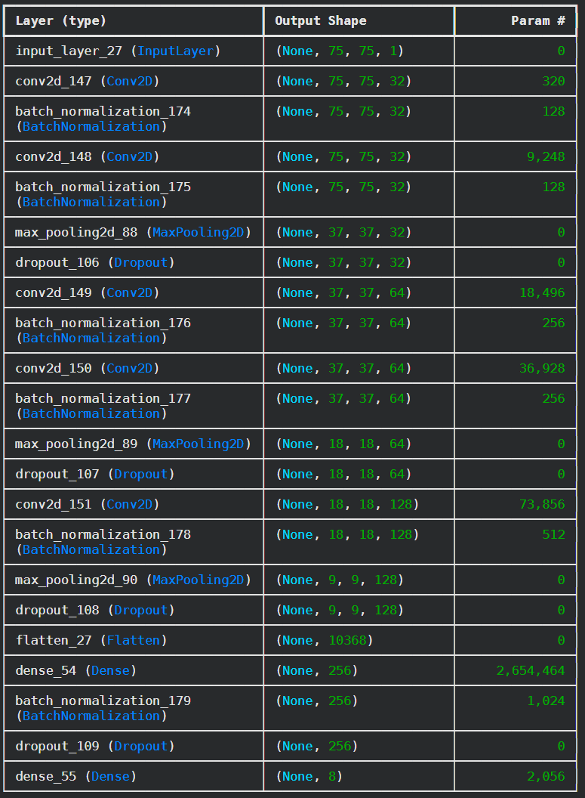

## 1. Datasets

In the initial stage, we familiarized ourselves with the datasets available on the internet. We mainly browsed resources located on platforms such as Kaggle, Roboflow, and Hugging Face. The size of some datasets reached a million images. Many of them, due to restrictive licenses, required additional consent from the creators for use.

### Table 1.1 – Example Datasets

| Name | Author | License | Size | Resolution | Number of Emotions | Source |
|-------|--------|----------|------------|---------------|---------------|--------|
| (fer2013+affectnet) dataset - Emotions | PrasadSomvanshi | Apache 2.0 | 61.7k | 48x48 | 7 | Kaggle |
| Balanced Affectnet Dataset (75x75, RGB) | dolly prajapati 182 | Unknown | 40.1k| 75x75 | 8 | Kaggle |
| Balanced RAF-DB Dataset (75x75) | dolly prajapati 182 | Unknown | 41.7k | 75x75 | 7 | Kaggle |
| Balanced NAVRASA Dataset (75x75, RGB) | dolly prajapati 182 | Unknown | 90k | 75x75 | 9 | Kaggle |
| Facial Affect Dataset Balanced | Viktor Modroczký | CC BY-NC-SA 3.0 IGO | 246k | 96x96 | 8 | Kaggle |
| emonet-face-big | laion | CC BY 4.0 | 203k | mixed | - | HuggingFace |
| Human Face Emotions | Samith Chimminiyan | Apache 2.0 | 59.1k | mixed | 5 | Kaggle |
| Facial Emotion Recognition Dataset | Fahadullah_A | CC BY 4.0 | 49.8k | mixed | 7 | Kaggle |

We decided to combine datasets whose licenses allow for their free use. This will increase the diversity and size of the target dataset, which reduces the risk of model overfitting.

## PyTorch vs TensorFlow Comparison
We conducted preliminary tests aimed at selecting the optimal framework for the model, which will ultimately be implemented on a Raspberry Pi. In this project, we are using the 8 GB RAM version, which provides us with a significant technological reserve. However, due to the ARM processor architecture, alongside accuracy, inference speed measured in frames per second (FPS) remains our main evaluation criterion. To reliably evaluate both environments, we tested two convolutional neural network (CNN) architectures:
1. Shallow Network: Composed of a small number of layers. In this scenario, PyTorch turned out to be the clear winner, generating nearly twice as many FPS thanks to lower system overhead during simple operations.
2. Deep Network: Composed of many convolutional layers and overfitting prevention mechanisms (Dropout). This architecture is absolutely essential to achieve satisfactory accuracy. In this case, TensorFlow performed significantly faster, proving that its mechanisms handle the optimization of heavy computational graphs better.

In light of the test results, we decided to ultimately use the TensorFlow environment. The higher performance of this framework for deep networks is crucial for our project. Furthermore, our chosen Raspberry Pi should have no trouble supporting this ecosystem, and the trained model itself will eventually be exported to the dedicated, lightweight TensorFlow Lite (TFLite) format. This will allow for maximum CPU offloading and guarantee smooth real-time camera image analysis.

## Neural Network Tests
Qualitative tests were conducted on the datasets presented in Table 1.1. This action allowed for identifying the best-annotated and most diverse dataset. A 7-layer neural network (the model diagram used for training is shown in Figure 3.1) was used for testing, implemented and trained in the TensorFlow environment. The total number of model parameters was approximately 2.8 million. All training processes were carried out in the Google Colab environment due to the availability of NVIDIA T4 GPUs, characterized by high computing power.

*Figure 3.1 - block diagram of the model used for training*

Based on the tests, the results of which are summarized in Table 3.2, the realistic effectiveness of the model was estimated at 60% to 78%. This value was considered satisfactory. The NAVRASA dataset, being the only one used for training in the RGB color space, allowed for achieving a relatively high accuracy of 78%. This may suggest that color information carries additional, important features that facilitate classification. The lowest results were recorded for the aggregated dataset (FER2013 and AffectNet) and the Facial Affect Dataset Balanced. This phenomenon indicates significant difficulty in extracting universal features when the training data comes from highly diverse visual environments.

Conversely, for the RAF-DB dataset, the model achieved an anomalously high accuracy of 91%. Upon verifying the structure of this dataset, it was noticed that some of the images contained within were created through the augmentation of other base photos. This led to the phenomenon of data leakage. In such a situation, the network did not learn to recognize universal features defining emotions, but merely memorized specific, repetitive images.

**Table 3.2 - Training Results**
| Dataset | Number of Epochs | BatchSize | Color Space | Test Set Accuracy |
|---|---|---|---|---|
| (fer2013+affectnet) dataset - Emotions | 20 | 32 | GrayScale | 64% |
| Balanced Affectnet Dataset (75×75, RGB) | 20 | 32 | GrayScale | 72% |
| Balanced NAVRASA Dataset (75×75, RGB) | 20 | 32 | RGB | 78% |
| Facial Affect Dataset Balanced | 20 | 32 | GrayScale | 60% |
