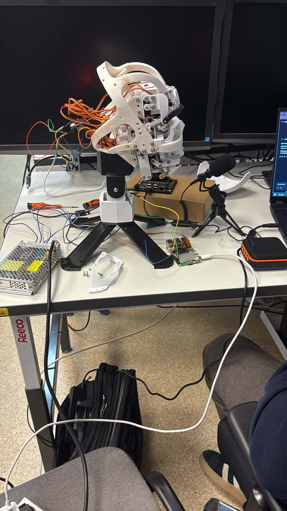

# Mettings Report
W celu finalnego połączenia wszystkich modułów w jeden gotowy i poprawnie działający system, spotkaliśmy się w sali koła naukowego CHIP. W spotkaniu uczestniczyła co najmniej jedna osoba z każdego zespołu projektowego (**vision, hardware, speech**).

# Metting at 13.05.2026 from 14:30 to 21:00
**Uczestnicy:** Wszyscy członkowie zespołu (obecność rotacyjna w trakcje trwania spotkania).
## Zrealizowane zadania
Podczas spotkania udało się zrealizować:

 - **Zgromadzono** w jednym miejscu wszystkie niezbędne elementy hardwearowe: kamerę, głośnik, mikrofon, czujnik FIR, Raspberry Pi, Jetson Orin Nano, zasilacze oraz wydrukowaną głowę robota z zamontowanymi serwomechanizmami.
 - **Zaprojektowane druki 3D:**
	 - Zaprojektowano i wydrukowano statyw do mikrofonu.
	 - Zaprojektowano i wydrukowano uchwyt do kamery.
- **Rozmieszczenie elementów:**
Ustalono docelowe położenie komponentów w obudowie oraz w otoczeniu robota. Kamera zostanie umieszczona na czole robota, natomiast mikrofon i głośnik znajdą się na zewnątrz jego podstawy. Z kolei Jetson, i Raspberry Pi wraz z zasilaczem zostaną umieszoczne wewnątrz podstawy robota.
- **Przeprowadzono testy mechaniki:**
prawdzono poprawne działanie poszczególnych serwomechanizmów za pomocą skryptu przygotowanego przez zespół hardwareowy.
-**Integracja skryptów programowych:**
Połączono skrypt odpowiedzialny za wykrywanie emocji z modułem śledzenia twarzy użytkownika (podążanie oczami robota za użytkownikiem).
-**Prace elektryczne:** Przedłużono zbyt krótkie przewody zasilacza.
-**Obwiednia sygnału:** Rozpoczęto prace nad przesyłaniem obwiedni sygnału audio (z modułu speech)  w celu symulowania ruchów ust robota podczas mowy.
-**Wymiana uszkodzonego serwa:** Wymieniono spalone serwo, które odpowiadało za poruszanie szczęką robota.

## Napotkane problemy
W trakcie integracji wszystkich komponentów napotkano kilka problemów technicznych, z których większość udało się rozwiązać na miejscu.

 - **Problemy z połączeniem z RPI:** Wystąpiły trudności z połączeniem się z Raspberry Pi, co było spowodowane zakłóceniami – w pomieszczeniu uruchomionych było zbyt wiele hotspotów jednocześnie.
 - **Spadek liczby FPS'ów:** Mała liczba klatkek wynikała z błędnej konfiguracji modułu komunikacyjnego pomiędzy Raspberry Pi a Jetsonem. Po zmianie parametru _dropout_ z 50 ms na 200 ms problem ustąpił, a płynność wróciła do normy.
 - **Konfiguracja magistrali I2C:** Domyślne porty na Raspberry Pi nie wykrywały sterowników. Wymagało to przepięcia sygnałów SDA i SCL na inne, odpowiednie piny GPIO.
 - **Uszkodzenia wydrukuów:** Wydrukowany uchwyt kamery okazał się zbyt delikatny – podstawa pękła podczas dokręcania śruby. **TODO:** Element wymaga poprawy modelu i ponownego wydruku.

# Metting at 14.05.2026 from 12:30 to 20:00
**Uczestnicy:** Mniejsza frekwencja ze względu na wyjazdy i pracę niektórych uczestników. Nie będziemy wymieniać tutaj z nazwisk kto konkretnie brał udział w spotkaniu.

## Zrealizowane zadania
Podczas spotkania udało się zrealizować:
- **Prace elektryczne:** Przelutowanie starych przewodów i zamiana na nowe, w tym przewody zasilacza
- **Prace nad kosmetyką:** Przeprowadzono wstępną przymiarkę sztucznej, silikonowej skóry (o grubości 1 mm), wykorzystywanej standardowo do próbnego tatuowania. Zdecydowano, że skóra będzie mocowana za pomocą magnesów neodymowych, co znacznie ułatwi jej ewentualny demontaż i wymianę.
-**Ponowne przetestowanie mechaniki:** Po wymianie serwa, przeprowadzono drugi test działania serw, który przebiegł pozytywnie.
-**Szczęka robota zsynchronizowana z mową:** Robot symuluje mówienie w momencie, gdy jest to konieczne (gdy model TTS generuje odpowiedź). 

## Plany na kolejne spotkania
- **TODO:** Połączenie wszystkiego i umieszczenie na docelowych miejscach.
- **TODO:** Wdrożenie mechanizmu, który wyczyści kontekst poprzedniej konwersacji w momencie, gdy system wizyjny rozpozna nowego użytkownika.
- **TODO:** Ustalenie kiedy głowa ma wyrażać emocje.

## Napotkane problemy
Podczas ponownego uruchomienia wszystkiego razem wystąpiły nieoczekiwane problemy, którym udało się zaradzić na miejscu.
- **Błąd komunikacji I2C:** Po wymianie przewodów i podłączeniu RPI nastąpił błąd komunikacji ze sterownikami.Ani domyślne, ani wcześniej zmienione piny nie wykrywały urządzeń. Ostatecznie konieczne było przypisanie sygnałów SDA i SCL do kolejnych, alternatywnych pinów GPIO. To przywróciło komunikację, ale ujawniło następny problem.

 
Rysunek 1: Głowa robota (Problem komunikacji ze sterownikami)

- **Uszkodzenie układu scalonego:** Raspberry Pi wykrywało tylko jeden z dwóch sterowników serwomechanizmów. Sprawdzono wszystkie optymistyczne wyjścia: złe połączenie przewodów, zimnne luty, źle zrobiona zworka, odpięte przewody, sprawdziliśmy zwarcia, ciągłość obowdów. Niestety okazało się, że uszkodzeniu uległ układ odpowiedzialny za sterowanie logiką cyfrową. Sytuację uratował zapasowy, identyczny sterownik, który na szczęście mieliśmy na miejscu.
- **Wypadek mechaniczny:** Przypadkowe szarpnięcie za listwę z kablami przez osobę trzecią doprowadziło do zniszczenia wydrukowanego uchwytu na kamerę.Wymagało to wydrukowanie nowego uchwytu na kamerę.

