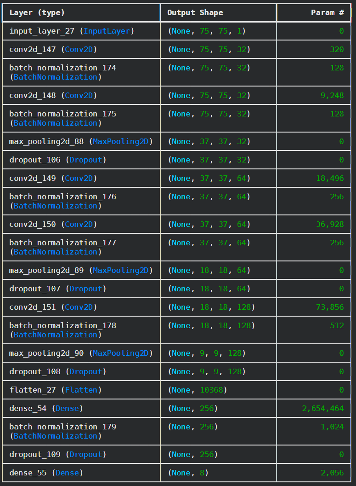

## 1. Zbiory danych

Na początkowym etapie zapoznaliśmy się z dostępnymi w internecie zbiorami danych. 
Przeglądaliśmy głównie zasoby znajdujące się na platformach takich jak Kaggle, Roboflow oraz Hugging Face. 
Liczebność niektórych zbiorów sięgała miliona zdjęć. 
Wiele z nich, ze względu na restrykcyjne licencje, wymagało uzyskania dodatkowej zgody twórców na wykorzystanie.

### Tabela 1.1 – Przykładowe zbiory danych

| Nazwa | Autor | Licencja | Liczebność | Rozdzielczość | Liczba emocji | Źródło |
|-------|--------|----------|------------|---------------|---------------|--------|
| (fer2013+affectnet) dataset - Emotions | PrasadSomvanshi | Apache 2.0 | 61,7 tys. | 48x48 | 7 | Kaggle |
| Balanced Affectnet Dataset (75x75, RGB) | dolly prajapati 182 | Unknown | 40,1 tys. | 75x75 | 8 | Kaggle |
| Balanced RAF-DB Dataset (75x75) | dolly prajapati 182 | Unknown | 41,7 tys. | 75x75 | 7 | Kaggle |
| Balanced NAVRASA Dataset (75x75, RGB) | dolly prajapati 182 | Unknown | 90 tys. | 75x75 | 9 | Kaggle |
| Facial Affect Dataset Balanced | Viktor Modroczký | CC BY-NC-SA 3.0 IGO | 246 tys. | 96x96 | 8 | Kaggle |
| emonet-face-big | laion | CC BY 4.0 | 203 tys. | mieszane | - | HuggingFace |
| Human Face Emotions | Samith Chimminiyan | Apache 2.0 | 59,1 tys. | mieszane | 5 | Kaggle |
| Facial Emotion Recognition Dataset | Fahadullah_A | CC BY 4.0 | 49,8 tys. | mieszane | 7 | Kaggle |

Zdecydowaliśmy się połączyć zbiory danych, których licencje pozwalają na ich swobodne wykorzystanie. 
Pozwoli to zwiększyć różnorodność oraz liczebność docelowego zbioru, co zmniejsza ryzyko przeuczenia modelu.

## Porównanie PyTorch vs TensorFlow
Przeprowadziliśmy wstępne testy mające na celu wybór optymalnego frameworka dla modelu, który docelowo zostanie zaimplementowany na Raspberry Pi. W projekcie korzystamy z wersji 8 GB pamięci RAM, która daje nam znaczący zapas technologiczny. Jednak ze względu na architekturę procesorów ARM, obok dokładności, jako główne kryterium oceny pozostaje nam szybkość wnioskowania mierzona w klatkach na sekundę (FPS). W celu rzetelnej oceny obu środowisk przetestowaliśmy dwie architektury sieci konwolucyjnych (CNN):
1. Płytką sieć (Shallow Network): Złożoną z niewielkiej liczby warstw. W tym scenariuszu zdecydowanym zwycięzcą okazał się PyTorch, który dzięki mniejszemu narzutowi systemowemu przy prostych operacjach wygenerował niemal dwukrotnie więcej FPS.
2. Głęboką sieć (Deep Network): Złożoną z wielu warstw splotowych i mechanizmów zapobiegających przeuczeniu (Dropout). Architektura ta jest absolutnie niezbędna, aby uzyskać zadowalającą dokładność. W tym przypadku TensorFlow zadziałał znacznie szybciej, udowadniając, że jego mechanizmy lepiej radzą sobie z optymalizacją ciężkich grafów obliczeniowych.

W związku z wynikami testów, zdecydowaliśmy się na ostateczne wykorzystanie środowiska TensorFlow. Wyższa wydajność tego frameworku w przypadku głębokich sieci jest dla naszego projektu kluczowa. Ponadto, wybrane przez nas Raspberry Pi nie powinno mieć problemów z obsługą tego ekosystemu, a sam wytrenowany model zostanie docelowo wyeksportowany do dedykowanego, lekkiego formatu TensorFlow Lite (TFLite). Pozwoli to na maksymalne odciążenie procesora i zagwarantuje płynną analizę obrazu z kamery w czasie rzeczywistym.

## Testy sieci neuronowej
Przeprowadzono testy jakościowe na zbiorach danych zaprezentowanych w tabeli nr 1.1. Działanie to pozwoliło na wyłonienie najlepiej zaanotowanego oraz najbardziej zróżnicowanego zbioru. Do testów wykorzystano 7-warstwową sieć neuronową (na rysunku 3.2 przedstawiono schemat modelu wykorzystanego do treningu), zaimplementowaną i wytrenowaną w środowisku TensorFlow. Całkowita liczba parametrów modelu wynosiła około 2,8 mln. Wszystkie procesy uczenia przeprowadzono w środowisku Google Colab ze względu na dostępność układów graficznych NVIDIA T4, charakteryzujących się wysoką mocą obliczeniową.

*Zdjęcie nr 3.1 - schemat blokowy modelu wykorzystanego do treningu*

Na podstawie testów, których wyniki zestawiono w tabeli nr 3.2, oszacowano realistyczną skuteczność modelu na poziomie od 60% do 78%. Wartość tę uznano za zadowalającą. Zbiór NAVRASA, jako jedyny wykorzystywany do treningu w przestrzeni barw RGB, pozwolił na uzyskanie stosunkowo wysokiej dokładności wynoszącej 78%. Może to sugerować, że informacja o kolorze niesie ze sobą dodatkowe, istotne cechy ułatwiające klasyfikację. Najniższe wyniki odnotowano dla zbioru agregowanego (FER2013 oraz AffectNet) oraz Facial Affect Dataset Balanced. Zjawisko to wskazuje na znaczną trudność w ekstrakcji uniwersalnych cech, gdy dane uczące pochodzą z wysoce zróżnicowanych środowisk wizualnych.

Z kolei dla zbioru RAF-DB model osiągnął anomalnie wysoką dokładność na poziomie 91%. Po weryfikacji struktury tego zbioru zauważono, że część zawartych w nim obrazów powstała w wyniku augmentacji pozostałych zdjęć bazowych. Doprowadziło to do zjawiska wycieku danych (ang. data leakage). W takiej sytuacji sieć nie uczyła się rozpoznawania uniwersalnych cech określających emocje, lecz jedynie zapamiętywała specyficzne, powtarzające się obrazy.

**Tabela nr 3.2 - Wyniki przeprowadzonych treningów**
| Dataset | Liczba epok | BatchSize | Przestrzeń barw | Dokładność na zbiorze testowym |
|---|---|---|---|---|
| (fer2013+affectnet) dataset - Emotions | 20 | 32 | GrayScale | 64% |
| Balanced Affectnet Dataset (75×75, RGB) | 20 | 32 | GrayScale | 72% |
| Balanced NAVRASA Dataset (75×75, RGB) | 20 | 32 | RGB | 78% |
| Facial Affect Dataset Balanced | 20 | 32 | GrayScale | 60% |
